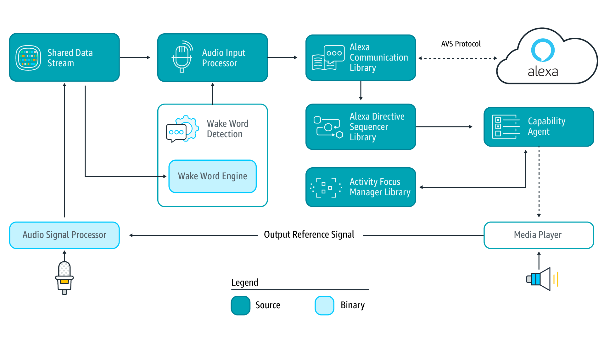

# Awesome Smart Speaker

> A Awesome List for Smart Speaker（智能音箱）

Platform
---

 * [Lucida](https://github.com/claritylab/lucida) - is a speech and vision based intelligent personal assistant inspired by Sirius.
 * [Jasper](https://github.com/jasperproject/jasper-client) - is an open source platform for developing always-on, voice-controlled applications.

SDK
---

 * [AVS Device SDK](https://github.com/alexa/avs-device-sdk) - provides C++-based (11 or later) libraries that leverage the AVS API to create device software for Alexa-enabled products. 
 * [Google Assistant SDK for Python](https://github.com/googlesamples/assistant-sdk-python) - samples and bindings for the Google Assistant API.

Hotword
---

 * [Snowboy](https://github.com/Kitt-AI/snowboy) - is a DNN based hotword and wake word detection toolkit.
 * [Mycroft Precise](https://github.com/MycroftAI/mycroft-precise) - is a neural network wake word listener for embedded architectures.
 
Voice Recognition
---

 * [CMU Sphinx](https://github.com/cmusphinx) - is an open source speech recognition system for mobile and server applications.
 * [HTK](http://htk.eng.cam.ac.uk/) - the Hidden Markov Model Toolkit (HTK) is a portable toolkit for building and manipulating hidden Markov models.
 * [Julius](http://julius.osdn.jp/en_index.php) - is a high-performance, two-pass large vocabulary continuous speech recognition (LVCSR) decoder software for speech-related researchers and developers. 
 * [Kaldi](https://github.com/kaldi-asr/kaldi) - is a speech recognition toolkit, freely available under the Apache License.
 * [Mozilla DeepSpeech](https://github.com/mozilla/DeepSpeech) - A TensorFlow implementation of Baidu's DeepSpeech architecture.
 
TTS
---

 * [CMU Flite](http://www.speech.cs.cmu.edu/flite/index.html) - is a small, fast run-time synthesis engine developed at CMU and primarily designed for small embedded machines and/or large servers. 
 * [Ekho](http://www.eguidedog.net/cn/ekho_cn.php) - is a free, open source and multilingual text-to-speech (TTS) software. Ekho 是一个免费、开源的中文语音合成软件。它目前支持粤语、普通话（国语）、广东台山话、诏安客语、藏语、雅言（中国古代通用语）和韩语（试验中），英语则通过 eSpeak 或 Festival 间接实现。Ekho支持Linux、Windows和Android平台。
 * [eSpeak](http://espeak.sourceforge.net/) - is a compact open source software speech synthesizer for English and other languages, for Linux and Windows.
 * [Festival](http://www.cstr.ed.ac.uk/projects/festival/) - ffers a general framework for building speech synthesis systems as well as including examples of various modules. 
 * [MARY TTS](https://github.com/marytts/marytts) - an open-source, multilingual text-to-speech synthesis system written in pure java.
 * [Merlin](https://github.com/CSTR-Edinburgh/merlin) - is a toolkit for building Deep Neural Network models for statistical parametric speech synthesis.
 * [Mimic](https://github.com/MycroftAI/mimic-core) - is a fast, lightweight Text-to-speech engine developed by Mycroft A.I. and VocaliD, based on Carnegie Mellon University’s Flite (Festival-Lite) software. 

NLP
---

 * [Ansj中文分词](https://github.com/NLPchina/ansj_seg) - 一个基于n-Gram+CRF+HMM的中文分词的java实现。
 * [compromise](https://github.com/nlp-compromise/compromise) - Natural language processing in javascript.
 * [FudanNLP](https://github.com/FudanNLP/fnlp) - is developed for Chinese natural language processing (NLP), which also includes some machine learning algorithms and [DataSet data sets] to achieve the NLP tasks. FudanNLP is distributed under LGPL3.0.
 * [Jieba](https://github.com/fxsjy/jieba) - is a Chinese text segmentation: built to be the best Python Chinese word segmentation module.
 * [gensim](https://github.com/RaRe-Technologies/gensim) - is a Python library for topic modelling, document indexing and similarity retrieval with large corpora.
 * [HanLP](https://github.com/hankcs/HanLP) - 是由一系列模型与算法组成的Java工具包，目标是普及自然语言处理在生产环境中的应用。HanLP具备功能完善、性能高效、架构清晰、语料时新、可自定义的特点。
 * [NLTK](https://github.com/nltk/nltk) - is a suite of open source Python modules, data sets and tutorials supporting research and development in Natural Language Processing.
 * [Stanford CoreNLP](https://github.com/stanfordnlp/CoreNLP) - provides a set of natural language analysis tools written in Java.
 * [spaCy](https://github.com/explosion/spaCy) - is a library for advanced natural language processing in Python and Cython.
 * [TextBlob](https://github.com/sloria/TextBlob) - is a Python (2 and 3) library for processing textual data.
 
 
Libs
---

Apps
---

 * [Flask-Ask](https://github.com/johnwheeler/flask-ask) - is a Flask extension that makes building Alexa skills for the Amazon Echo easier and much more fun.

Data & Models
---

 * [THCHS30](http://data.cslt.org/thchs30/standalone.html) - is an open Chinese speech database published by Center for Speech and Language Technology (CSLT) at Tsinghua University.
 * [THCHS30 Kaldi](http://data.cslt.org/thchs30-openslr/README.html) - is an open Chinese speech database published by Center for Speech and Language Technology (CSLT) at Tsinghua University.

Tutorials
---

 * [AVS on a Raspberry Pi step-by-step](https://github.com/alexa/alexa-avs-sample-app/wiki/Raspberry-Pi) - this guide provides step-by-step instructions for setting up AVS on a Raspberry Pi. It demonstrates how to access and test AVS using our Java sample app (running on a Raspberry Pi), a Node.js server, and a third-party wake word engine. You will use the Node.js server to obtain a Login with Amazon (LWA) authorization code by visiting a website using your Raspberry Pi's web browser.
  * [Diy Smart Home Assistant With Raspberry Pi and ReSpeaker Mic Array](http://www.instructables.com/id/Diy-Smart-Home-Assistant-With-Raspberry-Pi-and-ReS/) - ReSpeaker Mic Array, as the “ear” of Raspberry Pi here, can listen to your speech commands and send them to Raspberry Pi. According to your commands, Raspberry Pi will control Wio Link to do what you want via Wi-Fi.
  

### CMU Sphinx

 * [Install PocketSphinx on a Raspberry Pi](https://cmusphinx.github.io/wiki/raspberrypi/)
 * [PocketSphinx语音识别系统语言模型的训练和声学模型的改进](http://blog.csdn.net/zouxy09/article/details/7949126) 

Documents
---

 * [Snowboy, a Customizable Hotword Detection Engine as Smart Speaker](http://docs.kitt.ai/snowboy/) 

Architecture
---

### AWS Example

Origin Documents：[https://github.com/alexa/avs-device-sdk](https://github.com/alexa/avs-device-sdk)

This diagram illustrates the data flows between components that comprise the AVS Device SDK for C++. 

**Audio Signal Processor (ASP)** - Third-party software that applies signal processing algorithms to both input and output audio channels. The applied algorithms are designed to produce clean audio data and include, but are not limited to acoustic echo cancellation (AEC), beam forming (fixed or adaptive), voice activity detection (VAD), and dynamic range compression (DRC). If a multi-microphone array is present, the ASP constructs and outputs a single audio stream for the array.

**Shared Data Stream (SDS)** - A single producer, multi-consumer buffer that allows for the transport of any type of data between a single writer and one or more readers. SDS performs two key tasks: 

1. It passes audio data between the audio front end (or Audio Signal Processor), the wake word engine, and the Alexa Communications Library (ACL) before sending to AVS  
2. It passes data attachments sent by AVS to specific capability agents via the ACL  

SDS is implemented atop a ring buffer on a product-specific memory segment (or user-specified), which allows it to be used for in-process or interprocess communication. Keep in mind, the writer and reader(s) may be in different threads or processes.

**Wake Word Engine (WWE)** - Software that spots wake words in an input stream. It is comprised of two binary interfaces. The first handles wake word spotting (or detection), and the second handles specific wake word models (in this case "Alexa"). Depending on your implementation, the WWE may run on the system on a chip (SOC) or dedicated chip, like a digital signal processor (DSP).

**Audio Input Processor (AIP)** - Handles audio input that is sent to AVS via the ACL. These include on-device microphones, remote microphones, an other audio input sources.

The AIP also includes the logic to switch between different audio input sources. Only one audio input source can be sent to AVS at a given time.

**Alexa Communications Library (ACL)** - Serves as the main communications channel between a client and AVS. The ACL performs two key functions:

1. Establishes and maintains long-lived persistent connections with AVS. ACL adheres to the messaging specification detailed in [Managing an HTTP/2 Connection with AVS](https://developer.amazon.com/public/solutions/alexa/alexa-voice-service/docs/managing-an-http-2-connection).
2. Provides message sending and receiving capabilities, which includes support JSON-formatted text, and binary audio content. For additional information, see [Structuring an HTTP/2 Request to AVS](https://developer.amazon.com/public/solutions/alexa/alexa-voice-service/docs/avs-http2-requests).

**Alexa Directive Sequencer Library (ADSL)**: Manages the order and sequence of directives from AVS, as detailed in the [AVS Interaction Model](https://developer.amazon.com/public/solutions/alexa/alexa-voice-service/reference/interaction-model#channels). This component manages the lifecycle of each directive, and informs the Directive Handler (which may or may not be a Capability Agent) to handle the message.

**Activity Focus Manager Library (AFML)**: Provides centralized management of audiovisual focus for the device. Focus is based on channels, as detailed in the [AVS Interaction Model](https://developer.amazon.com/public/solutions/alexa/alexa-voice-service/reference/interaction-model#channels), which are used to govern the prioritization of audiovisual inputs and outputs.

Channels can either be in the foreground or background. At any given time, only one channel can be in the foreground and have focus. If multiple channels are active, you need to respect the following priority order: Dialog > Alerts > Content. When a channel that is in the foreground becomes inactive, the next active channel in the priority order moves into the foreground.

Focus management is not specific to Capability Agents or Directive Handlers, and can be used by non-Alexa related agents as well. This allows all agents using the AFML to have a consistent focus across a device.

